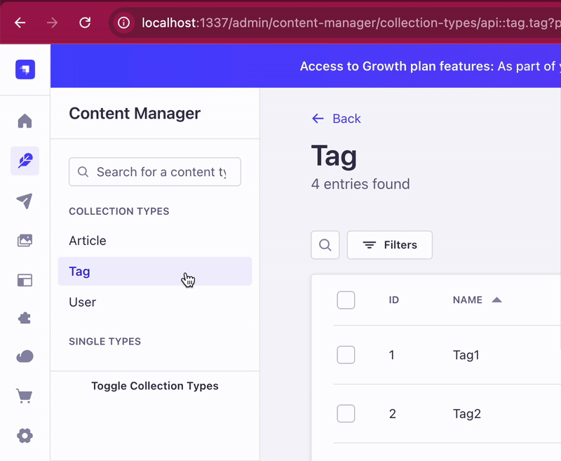

# 🚀 Getting started with Strapi

### `develop`

```
npm run develop
```

## ⚙️ Registering the custom plugin
First, we need to build the custom plugin. Navigate to the plugin directory and run:
```cd src/plugins/custom-badge-field
npm install
npm run build
```

To register the plugin, you need to add it to the `./config/plugins.ts` file of your Strapi project:
```
'custom-badge-field': {
    enabled: true,
    resolve: './src/plugins/custom-badge-field'
},
```

### 🛠️ How to add the custom field to a content type
1. Go to the Content-Types Builder in the Strapi admin panel.
2. Select the content type you want to add the custom field to or create a new one.
3. Click on the "Add New Field" button.
4. In the field type selection modal, click on the "Custom" tab.
5. Select the "Badge Color" field from the list of custom fields.
6. Configure the field settings as needed (e.g., name).
7. Click on the "Finish" button to add the field to your content type.
8. Save the content type to apply the changes.
9. Now you can use the "Badge Color" custom field in your content type to select a color badge.

## 🧪 Testing the relationship validation article - tags
1. Go to the "Articles" section in the Strapi admin panel and try to create a new article.
2. Attempt to save the article with less than 2 tags selected.
3. You should see a validation error message indicating that at least 2 tags are required.
4. Now, select 2 or more tags and save the article again. You should be able to save the article successfully this time.
5. This confirms that the relationship validation for a minimum of 2 tags is working correctly.


## Admin Extensions - Side Menu Customization - Collapsible Sections
To customize the side menu in the Strapi admin panel and create collapsible sections, there are currently 2 available options:
1. **Using the `/src/admin/app` file which can import any file located in the `/src/admin/extensions` folder.**
*This is the recommended approach as it is officially supported by Strapi.*
2. **Using the `patch-package` approach to override the default `@strapi/content-manager` package files.**
*This approach is not officially supported by Strapi and may break with future updates.*

### Option 1: Using the `/src/admin/app` file
1. Rename the `app.example.tsx` file to `app.tsx` in the `/src/admin` directory.
2. Create a new file named `CollapsibleCollectionTypesComponent.tsx` in the `/src/admin/extensions
3. Add the custom component into the admin panel by importing it in the `app.tsx` file and injecting it into 
the content manager layout using the injectComponent function.
4. Since the LeftMenu component doesn't have any injection zones, we injected it into the `listView` layout and control the menu sections from there. (For illustrative purposes only)


### Option 2: Using the `patch-package` approach
1. Install the `patch-package` and `postinstall-postinstall` packages as dev dependencies
2. Create a `patches` folder in the root of your project.
3. Modify the `LeftMenu.tsx` file from the `strapi` repository located in `strapi/packages/core/content-manager/admin/src/components/LeftMenu.tsx`.
4. Build the Strapi admin panel using the `npm run build` command.
5. Copy the modified `LeftMenu.js` and `LeftMeny.mjs` files from `strapi/packages/core/content-manager/dist/admin/components` to the `node_modules/@strapi/content-manager/dist/admin/components` in your Strapi project.
6. After making changes, run the `npx patch-package @strapi/content-manager` command to create a patch file.
7. Add a `postinstall` script in your `package.json` to apply the patch after every installation:
```json
"scripts": {
  "postinstall": "patch-package"
}
```
7. Now, every time you run `npm install` or `yarn install`, the patch will be applied automatically.


